# 3_UI — Input Showcase & Importance

## 🎯 Purpose

Document the key **input elements** used for the AI vs. Freelancer experiment. These images showcase the creative assets, analytics data, and reference materials that drive decision-making.

**Premise:** Understanding what goes *into* the project helps validate what comes *out*.

---

## 🖼️ Core Input Assets

### 1. AI-Generated Thumbnail (Baseline)

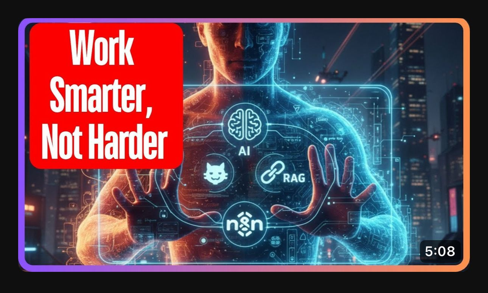

**Why This Matters:**
- **Baseline Reference:** Represents the current, cost-free approach to thumbnail creation
- **Quality Benchmark:** AI tools like Canva provide quick, consistent designs
- **Speed:** Can be generated in minutes without external dependencies
- **Scalability:** Unlimited variations without freelancer bottlenecks
- **Cost:** Zero direct cost, only tool subscription

**Project Role:**
Used as **Variant A** in our first A/B test to establish whether professional design is worth paying for.

---

### 2. Freelancer-Generated Thumbnails (Professional Design)

#### Thumbnail Design (Primary)


**Why This Matters:**
- **Professional Quality:** Human creativity and design expertise apply design principles AI might miss
- **Brand Consistency:** Freelancer (Yeanur Alam) aligns design with channel identity
- **Emotional Design:** Purposeful use of psychology to drive engagement
- **Testing Variable:** Directly comparable to AI version for CTR impact

**Project Role:**
Used as **Variant B** in our A/B test to measure performance improvement against baseline AI design.

---

#### Emotions & Design Thinking Process
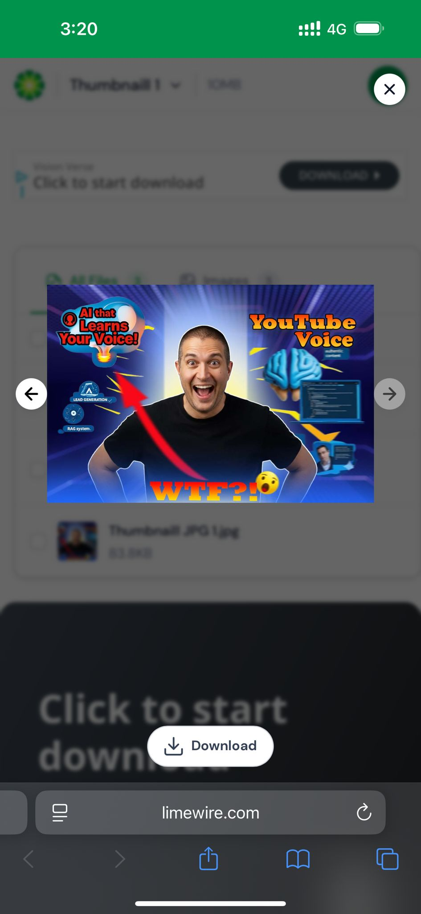

**Why This Matters:**
- **Strategic Approach:** Shows freelancer uses data (Gemini AI insights) + human intuition
- **Psychology-Driven:** Understands emotional triggers for YouTube CTR
- **Research-Backed:** Not random design choices—validated by AI analysis
- **Reproducibility:** Demonstrates a *framework* we can scale to future thumbnails

**Project Role:**
Validates that freelancer approach is **systematic**, not arbitrary. Important for ROI justification.

---

#### Alternative Resolutions & Formats
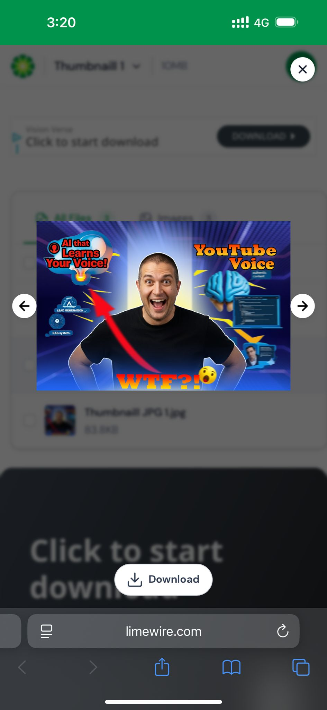

**Why This Matters:**
- **Platform Optimization:** YouTube requires specific dimensions (1280×720 @ 16:9)
- **Device Compatibility:** Thumbnails must render perfectly on desktop, mobile, TV
- **Format Variations:** Different file formats for different upload scenarios
- **Quality Assurance:** Shows attention to technical details

**Project Role:**
Ensures freelancer deliverables meet YouTube's strict technical requirements. Poor formatting = automatic CTR loss.

---

#### Secondary Design Variations
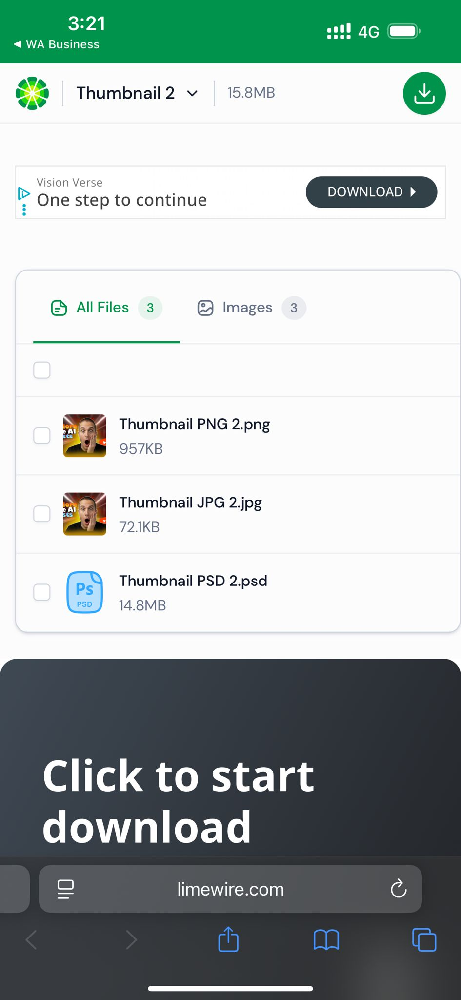

**Why This Matters:**
- **Multiple Options:** Freelancer provides alternatives for A/B testing within the A/B test
- **Experimentation Framework:** We can test which specific design resonates best
- **Flexibility:** Not locked into single design choice
- **Learning:** Different variations teach us about audience preferences

**Project Role:**
Enables **secondary optimization** even within the primary Variant B test.

---

#### Design Sharing & Collaboration
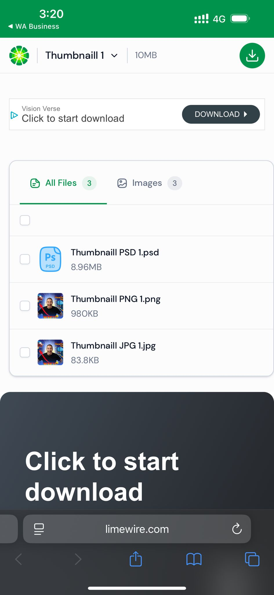

**Why This Matters:**
- **Transparency:** Clear communication of deliverables and status
- **Accountability:** Documented handoff of assets
- **Organization:** Professional project management approach
- **Traceability:** Easy to track which version was used when

**Project Role:**
Shows freelancer professionalism and documentation habits—valuable for scaling multiple tests.

---

## 📊 YouTube Analytics Inputs (Baseline Data)

### Channel Overview & Stats


**Why This Matters:**
- **Establishes Baseline:** Current channel performance before major optimizations
- **Context:** Viewer count, subscriber count, watch time metrics
- **Reference Point:** Measures progress against these starting figures

**Project Role:**
**Critical Baseline Data** for OKR 1-4. All future improvements will be measured against these numbers.

---

### Content Analytics (28-Day Window)
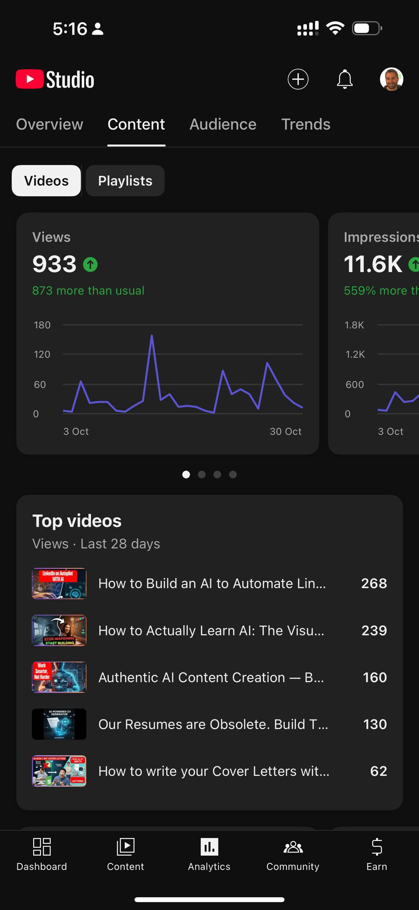

**Why This Matters:**
- **Topic Performance:** Shows which video topics generate most views/engagement
- **Watch Time Distribution:** Identifies heavy hitters vs. underperformers
- **Content Validation:** Validates our 4-pillar content strategy
- **Content Planning:** Informs which topics to prioritize

**Project Role:**
Maps to **OKR 3: Content-Market Fit**. Shows which content types already perform well (don't change) vs. which need improvement.

---

### Top Performing Content (28 Days)
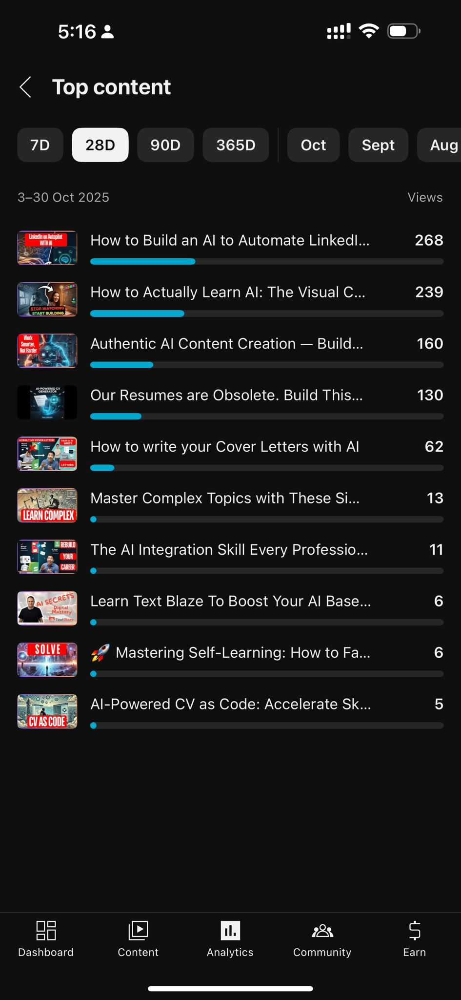

**Why This Matters:**
- **Success Patterns:** Reveals what *actually* works with audience
- **Thumbnail Effectiveness:** Top videos likely have effective thumbnails
- **Replication Strategy:** What made these succeed? Can we repeat it?
- **ROI Focus:** Best place to test freelancer designs

**Project Role:**
Identifies ideal videos for **A/B testing freelancer designs** (start with existing winners).

---

### CTR (Click-Through Rate) Analysis
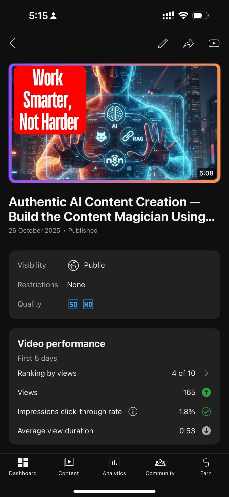

**Why This Matters:**
- **Primary Metric:** CTR is our main success metric (OKR 1)
- **Current Performance:** Baseline against which we measure freelancer improvement
- **Thumbnail Quality Indicator:** Direct measure of thumbnail effectiveness
- **A/B Test Benchmark:** Pre-test data for comparison

**Project Role:**
**Key Input for A/B test comparison**. Freelancer CTR must exceed this baseline to justify $20 investment.

---

### Impressions & Reach Data (28 Days)
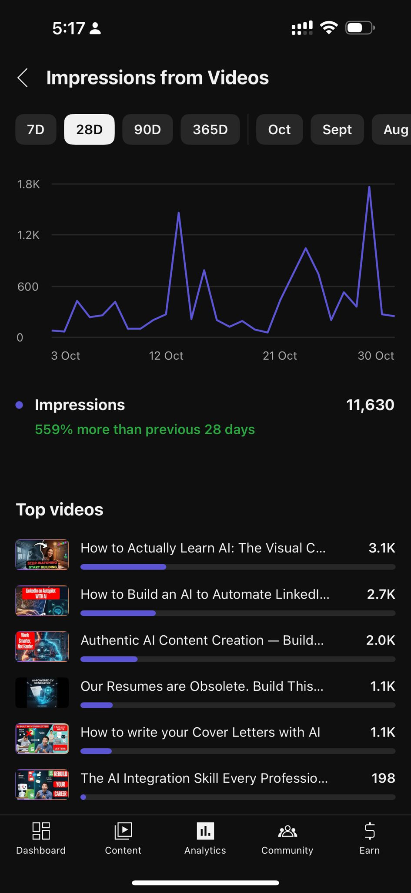

**Why This Matters:**
- **Sample Size:** More impressions = more statistically valid CTR comparison
- **Reach:** Shows how many people see the thumbnail (denominator for CTR)
- **Trends:** Identifies growth or decline in visibility
- **Audience Reach:** Validates that audience sees our content

**Project Role:**
Ensures **A/B test validity**. Higher impressions = more confident CTR measurement.

---

### Watch Time Analytics (28 Days)
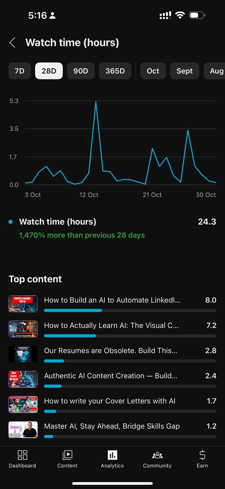

**Why This Matters:**
- **Engagement Depth:** Beyond clicks, are viewers actually *watching*?
- **Content Quality:** High watch time indicates good content, not just clickbait
- **Average View Duration:** Measures audience satisfaction
- **Secondary Metric:** Track alongside CTR for holistic view

**Project Role:**
Ensures freelancer thumbnail doesn't sacrifice **watch time for clicks**. We want engaged viewers, not bounces.

---

### Audience Demographics
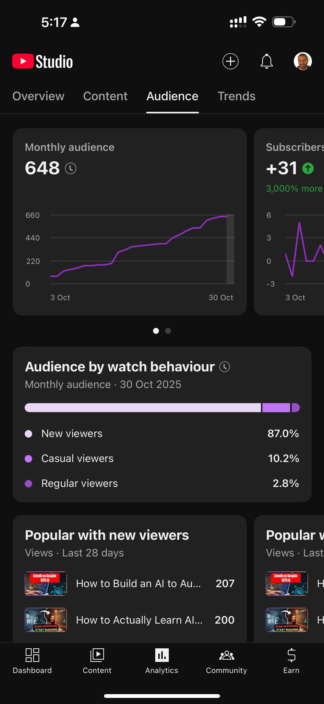

**Why This Matters:**
- **Targeting Validation:** Confirms audience matches target persona (22-45, tech professionals)
- **Geographic Distribution:** Validates geographic focus (North America primary)
- **Device Usage:** Informs thumbnail optimization (mobile-first design)
- **Segment Insights:** Shows which demographics engage most

**Project Role:**
Validates that **OKR 2 audience targeting is accurate**. Freelancer designs should appeal to this demographic.

---

### Subscriber Growth (90 Days)
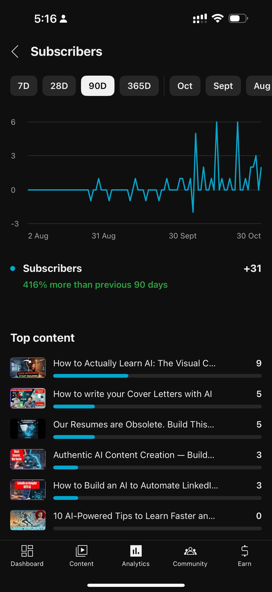

**Why This Matters:**
- **Long-term Growth:** Measures sustainable audience building (OKR 2 target: +30%)
- **Trend Direction:** Growing, flat, or declining?
- **Retention:** Are viewers becoming loyal subscribers?
- **Channel Health:** Subscriber growth indicates overall channel quality

**Project Role:**
**OKR 2 benchmark data**. Freelancer improvements should increase subscriber conversion rates.

---

### Overview Dashboard
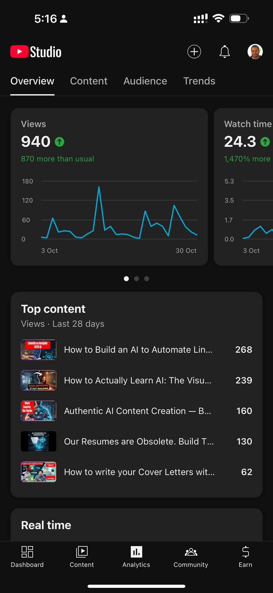

**Why This Matters:**
- **One-Glance Status:** Comprehensive view of all key metrics
- **Trend Indicators:** Shows positive/negative momentum
- **Cross-Metric Context:** Relationships between views, watch time, engagement
- **Decision Support:** Quick reference for strategic choices

**Project Role:**
**Weekly check-in dashboard**. Reference when making optimization decisions.

---

### Authentic AI Video Performance
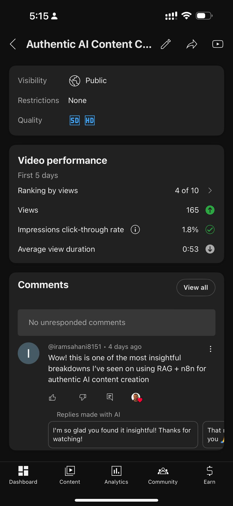

**Why This Matters:**
- **AI Content Validation:** Shows that AI-generated *content* (not just thumbnails) works
- **Audience Reception:** Proves market acceptance of AI-created videos
- **Competitive Advantage:** We can scale AI content + improve AI thumbnails with freelancer support
- **Hybrid Strategy:** Combined AI content + professional thumbnails = optimal approach

**Project Role:**
**Strategic Insight**: This validates our **hybrid approach** (AI efficiency + Freelancer quality).

---

### Watch Time Trends (28 Days)


**Why This Matters:**
- **Temporal Patterns:** When do viewers engage most?
- **Content Freshness:** Are older videos still getting watch time?
- **Audience Activity:** Helps schedule uploads for maximum impact
- **Consistency Tracking:** Stable or declining trends?

**Project Role:**
Informs **content calendar timing** for future videos in OKR 2.

---

### Subscribers Analytics
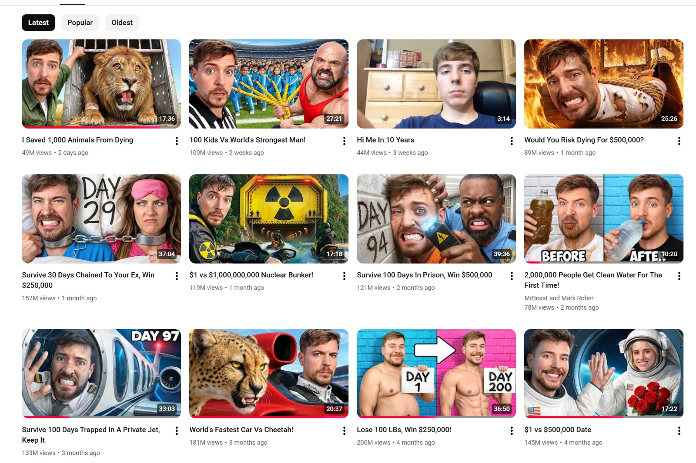

**Why This Matters:**
- **Subscription Rate:** Percentage of viewers who subscribe (conversion metric)
- **New Subscribers Source:** Which content drives most subscriptions?
- **Retention:** Do new subscribers stay?
- **Growth Sustainability:** Linear or exponential growth?

**Project Role:**
**OKR 2 tracking**: Monitor +30% subscriber growth target progress.

---

### Related Trends & Insights
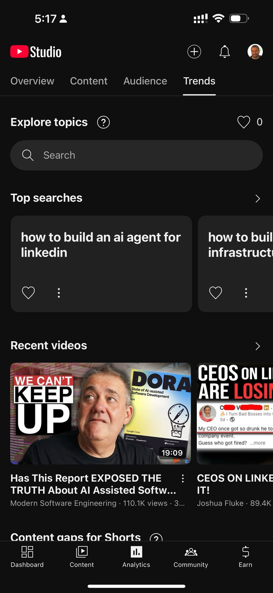

**Why This Matters:**
- **Market Opportunity:** Trending topics indicate audience interest
- **Content Opportunities:** Topics related to our niche are already in demand
- **Competitive Landscape:** Understand what audiences are looking for
- **Content Planning:** Align future videos with trending interests

**Project Role:**
**Content Strategy Input** for OKR 3 (Content-Market Fit). Ensures we create content audiences actively search for.

---

## 🔄 Input-Output Flow

```
┌─────────────────────────────────────────┐
│       INPUTS (This Document)            │
├─────────────────────────────────────────┤
│  • AI Thumbnail (Variant A)             │
│  • Freelancer Thumbnail (Variant B)     │
│  • Current Analytics Baseline           │
│  • Audience Demographics                │
│  • Top Performing Videos                │
└────────────┬────────────────────────────┘
             │
             ▼
    ┌────────────────────┐
    │   A/B TEST RUNS    │
    │   (14 Days)        │
    └────────┬───────────┘
             │
             ▼
┌─────────────────────────────────────────┐
│       OUTPUTS (2_Environment)           │
├─────────────────────────────────────────┤
│  • CTR Comparison Results               │
│  • Watch Time Impact                    │
│  • ROI Analysis ($20 investment)        │
│  • Recommendations                      │
│  • Scaling Strategy                     │
└─────────────────────────────────────────┘
```

---

## ✅ Input Validation Checklist

Before each A/B test, verify these inputs are **ready**:

### Thumbnail Assets
- [ ] AI thumbnail downloaded and verified
- [ ] Freelancer thumbnail(s) received
- [ ] Both thumbnails meet YouTube specs (1280×720 @ 16:9)
- [ ] Both thumbnails are high quality (no compression artifacts)

### Analytics Data
- [ ] Current baseline metrics captured
- [ ] 28-day historical data available
- [ ] Audience demographic breakdown complete
- [ ] Top performing videos identified

### Test Setup
- [ ] Video selected for A/B test
- [ ] Both thumbnail variants queued in YouTube Studio
- [ ] Test duration confirmed (14 days)
- [ ] YouTube A/B test feature confirmed enabled

### Documentation
- [ ] Input data captured in this document
- [ ] Screenshots stored with timestamps
- [ ] Freelancer agreement confirmed
- [ ] Success criteria clearly defined

---

## 📌 Why These Inputs Matter to the Project

### For OKR 1: Maximize CTR
- **Thumbnail Design Inputs** directly impact impression-to-click conversion
- **Baseline CTR Data** enables fair A/B test comparison
- **Freelancer Design Process** ensures strategic approach, not random changes

### For OKR 2: Grow Audience
- **Audience Demographics** confirm we're reaching right people
- **Content Performance Data** guides which topics to prioritize
- **Subscriber Trends** track progress toward +30% target

### For OKR 3: Validate Content-Market Fit
- **Top Content Analytics** reveals which topics already resonate
- **Related Trends** show market demand for future content
- **Watch Time Data** measures content quality (not just views)

### For OKR 4: Optimize Investment (AI vs. Freelancer)
- **Freelancer Deliverables** provide concrete comparison point
- **Current Baseline Metrics** establish ROI calculation baseline
- **Multiple Design Variations** enable secondary testing

---

## 🎯 Key Insights from Inputs

1. **Channel Already Has Momentum:** Baseline metrics show existing audience and engagement
2. **Audience is Right Fit:** Demographics align with target personas (22-45, tech professionals)
3. **AI Content Works:** AI-generated videos perform well, proving model is sound
4. **Multiple Test Options:** Freelancer provided variations for iterative testing
5. **Data is Comprehensive:** Rich analytics enable sophisticated analysis

---

## 📈 How to Use This Document

1. **Before A/B Test:** Review input assets to ensure quality and readiness
2. **During Test:** Reference baseline metrics to track progress
3. **After Test:** Use input data to contextualize results in `2_Environment/youtube_studio.md`
4. **For Learning:** Study freelancer approach (why did they choose these design elements?)
5. **For Scaling:** Use this as template for future A/B tests

---

## 🔗 Related Documents

- **1_Real/OKRs.md** — Strategic objectives these inputs support
- **2_Environment/youtube_studio.md** — Where input data becomes output metrics
- **4_Formula/DELIVERY_FRAMEWORK_SETUP.md** — Best practices for input documentation

---

**Document Status:** ✅ Input Assets Collected
**Last Updated:** October 31, 2025
**Next Review:** After A/B test results (Nov 14, 2025)